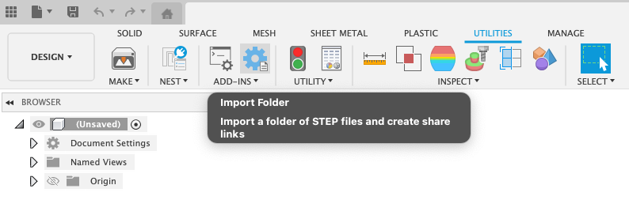
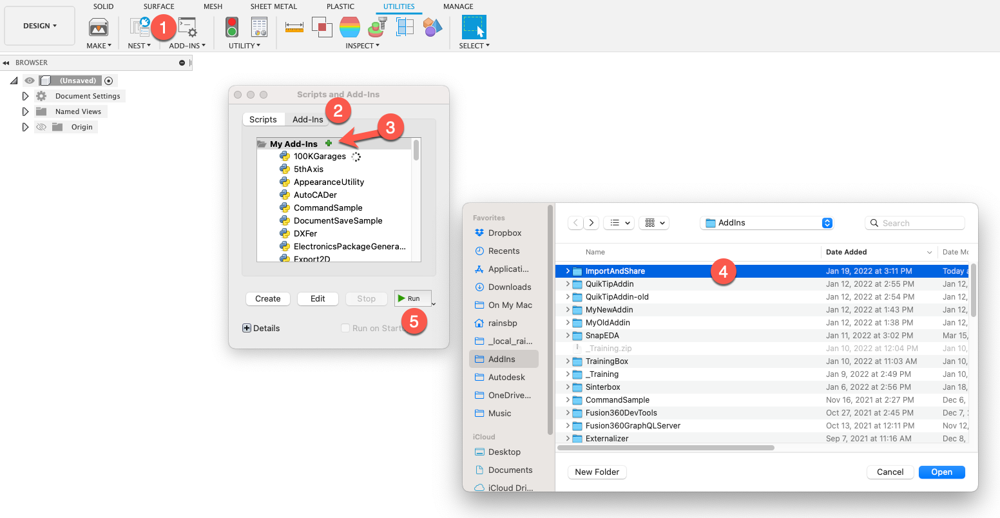
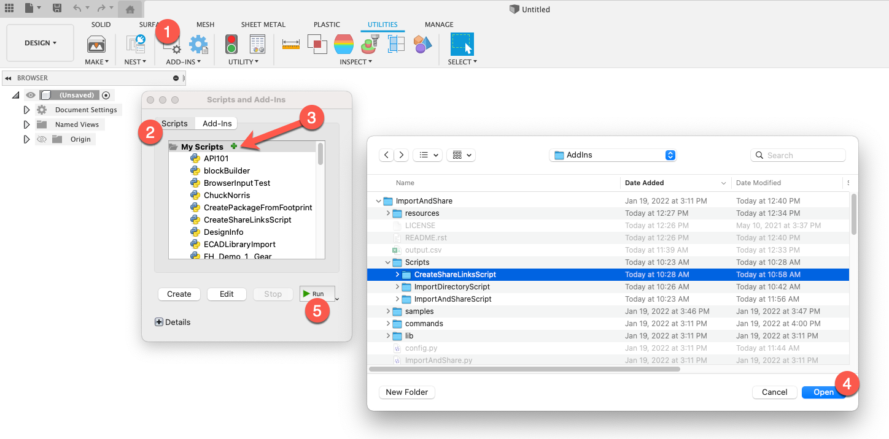

Import And Share
================
Demo Addin to import STEP files and create public share links.

This sample application makes use of the new Data Event
that is fired when the cloud data (DataFile) is available
for a newly saved (or imported) Fusion 360 Document.

`Learn More <https://help.autodesk.com/view/fusion360/ENU/?guid=GUID-049CC6A8-10A5-47AD-B5DE-10B29721548A>`_

Usage
-----
Run the app.

Click the Icon on the Utilities Tab in the Add-ins Panel

You will be prompted to select a directory

All STEP files in this directory will be imported to the active project and a share link will be created.

The resulting Public-Share-links and Version ID's will be stored in a csv file in this directory called output.csv

Installation
------------
- `Download or clone the latest version <https://github.com/tapnair/ImportAndShare/archive/refs/heads/master.zip>`_
- Unzip the archive to a permanent location on your computer
- It is important that the directory be named *ImportAndShare*.

*Note: If you are downloading the zip file from github it typically appends -master to the folder name.
You must rename the folder for Fusion 360 to recognize the addin.*

After you download and extract the zip file:

1.	Open the scripts and add-ins dialog box
2.	Select the add-ins tab in the top of the dialog
3.	Click the little green plus button to add the add-in
4.	Select the directory named Export2D and click the open button
5.	With it selected click the run button at the bottom of the dialog

Sample Scripts
--------------

You can follow the same procedure, but on the Scripts tab to run one of the smaller sample scripts
as opposed to the Add-in.

These scripts demonstrate smaller pieces of the functionality in a more isolated way.

ImportDirectoryScript
^^^^^^^^^^^^^^^^^^^^^

This will import all STEP files in the selected directory and leave them open

CreateShareLinksScript
^^^^^^^^^^^^^^^^^^^^^

This will create share links for all open documents and then close them if the cloud data is ready.

ImportAndShareScript
^^^^^^^^^^^^^^^^^^^^^

This will perform the import, create share link, and close the files.
The main difference here is that it does not create a command icon and is not using the full Add-in Framework.
It does show the implementation of an Event Handler to react when the imported files are ready for processing.

License
-------
THE SOFTWARE IS PROVIDED "AS IS", WITHOUT WARRANTY OF ANY KIND, EXPRESS OR IMPLIED,
INCLUDING BUT NOT LIMITED TO THE WARRANTIES OF MERCHANTABILITY, FITNESS FOR A PARTICULAR PURPOSE AND NONINFRINGEMENT.
IN NO EVENT SHALL THE AUTHORS OR COPYRIGHT HOLDERS BE LIABLE FOR ANY CLAIM, DAMAGES OR OTHER LIABILITY,
WHETHER IN AN ACTION OF CONTRACT, TORT OR OTHERWISE, ARISING FROM, OUT OF OR IN CONNECTION WITH THE SOFTWARE
OR THE USE OR OTHER DEALINGS IN THE SOFTWARE.

`MIT License`_

.. _MIT License: ./LICENSE

Authors
-------
`Import And Share` was written by `Patrick Rainsberry <patrick.rainsberry@autodesk.com>`_.

